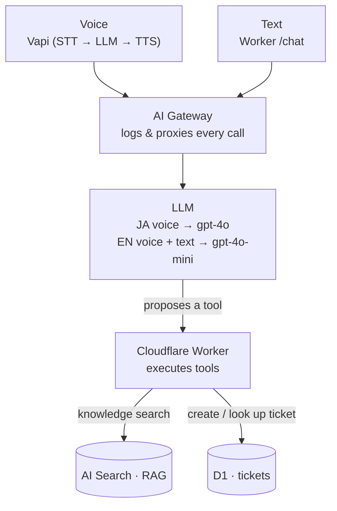

# Gatewise — Bilingual Voice + Text Support Agent

A reference implementation of a **grounded, bilingual (EN / JA) AI support agent** — over both **voice and text** — built on [Vapi](https://vapi.ai/) and Cloudflare (Workers, AI Gateway, AI Search, D1).

The agent answers only from a knowledge base (RAG), **refuses to guess** and escalates when it doesn't know, opens and routes support tickets, and runs the model tier that fits each channel and language.

> **Live demo:** https://saas-console-apq.pages.dev
> **Writeup (Japanese):** https://qiita.com/sooncloud/items/7dc5eaf1ea2a4b7a93dc

> ⚠️ This is a **sanitized reference implementation**. All account IDs, resource IDs, and API keys are placeholders — see [Configuration](#configuration). Nothing secret is committed.

---

## What it is

"Gatewise" is a fictional Zero Trust identity SaaS (SSO / SCIM / device posture). This repo is its support agent:

- **Two channels, one core.** Voice comes in through Vapi; text comes in through a Cloudflare Worker. Both converge on the same tools and data.
- **Grounded.** Every product question is answered from the knowledge base via RAG. If there's no match, the agent says so and offers to open a ticket — it does **not** hallucinate.
- **Acts, and routes.** It opens tickets, sets priority, and routes to the right team (not to sales).
- **Bilingual.** English and Japanese, with the model, voice, and tools tuned per language.

## Architecture



- **Vapi** — voice orchestration (STT · LLM call · TTS · turn-taking)
- **Cloudflare Worker** — the runtime that executes all tools; the only thing that touches data
- **AI Gateway** — one entry point that logs and proxies every model call
- **AI Search / D1** — the knowledge base (RAG) and the ticket store

The design principle: **the model proposes, the Worker executes.** The model can only ever request one of three tools; the Worker validates and is the only component with access to the data.

## Tech stack

| Layer | Choice |
|---|---|
| Voice orchestration | Vapi |
| Model | OpenAI `gpt-4o` (JA voice) · `gpt-4o-mini` (EN voice + all text) |
| TTS | Azure `ja-JP-NanamiNeural` (JA) · Cartesia (EN) |
| STT | Deepgram / ElevenLabs Scribe (with keyterm tuning) |
| Runtime / tools | Cloudflare Workers |
| Gateway | Cloudflare AI Gateway |
| Retrieval (RAG) | Cloudflare AI Search |
| Ticket store | Cloudflare D1 |
| Console UI | Cloudflare Pages |

## Repository structure

```
.
├─ README.md
├─ worker/
│  ├─ src/index.js              # tool backend + custom-llm proxy + /chat + /tickets
│  ├─ schema.sql                # D1 tickets table
│  ├─ wrangler.toml.example     # account_id / D1 id as placeholders
│  └─ .dev.vars.example         # OPENAI_API_KEY=... (real file is gitignored)
├─ console/
│  ├─ index.html                # reads config from config.js
│  ├─ config.example.js         # Vapi public key + assistant IDs (placeholders)
│  └─ assets/                   # logo / icon files
├─ prompts/
│  ├─ system-en.md              # English voice assistant prompt
│  └─ system-ja.md              # Japanese voice assistant prompt (_JP tools)
├─ knowledge-base/              # sample Gatewise docs (fictional) for RAG
│  ├─ README.md                 # notes on the corpus
│  ├─ en/                       # English docs (SSO, SCIM, posture, ...)
│  └─ ja/                       # Japanese docs + glossary-terms-ja.md
├─ vapi/
│  ├─ assistant-en.example.json # sanitized assistant config
│  ├─ assistant-ja.example.json
│  ├─ tools.example.json        # tool (function) definitions
│  └─ endpointing-patch.md      # startSpeakingPlan tuning notes
└─ .gitignore                   # .env, .dev.vars, *.log, call-logs-*
```

## Getting started

### Prerequisites

- A Cloudflare account (Workers, Pages, AI Gateway, AI Search, D1)
- A Vapi account
- An OpenAI API key with access to `gpt-4o` and `gpt-4o-mini`
- `wrangler` CLI (`npm i -g wrangler`)

### 1. Configure

```bash
git clone <this-repo> && cd gatewise-agent

# Worker config + secrets
cp worker/wrangler.toml.example worker/wrangler.toml     # fill in account_id, D1 id
cp worker/.dev.vars.example worker/.dev.vars             # add OPENAI_API_KEY (gitignored)

# Console config
cp console/config.example.js console/config.js           # Vapi public key + assistant IDs
```

### 2. Provision Cloudflare resources

```bash
# D1
wrangler d1 create saas-agent-db
# then apply the schema in worker/schema.sql

# AI Search: create an instance and index the docs in knowledge-base/
# AI Gateway: create a gateway; note the /openai (BYOK) endpoint URL
```

### 3. Deploy the Worker

```bash
cd worker
wrangler secret put OPENAI_API_KEY     # production secret (never commit)
wrangler deploy
```

### 4. Configure the Vapi assistants

Create two assistants (EN and JA) using the sanitized configs in `vapi/`. Key points:

- JA voice → `gpt-4o`; EN voice → `gpt-4o-mini`
- JA assistant uses the `_JP` tools and a Japanese system prompt
- Point the custom-llm URL at the Worker's `/chat/completions` (proxied through the AI Gateway `/openai` BYOK endpoint)

### 5. Deploy the console

```bash
cd console
wrangler pages deploy . --project-name saas-console
```

## Configuration

| Value | Where it lives | Committed? |
|---|---|---|
| `OPENAI_API_KEY` | `wrangler secret` / `.dev.vars` | ❌ never |
| Vapi **private** key | your shell / CI secret | ❌ never |
| Cloudflare account ID | `wrangler.toml` | ⚠️ placeholder in `.example` |
| D1 database ID | `wrangler.toml` | ⚠️ placeholder |
| Vapi **public** key + assistant IDs | `console/config.js` | ⚠️ placeholder in `.example` |
| Worker URL | `console/config.js` | ⚠️ placeholder |

## Notable engineering

Most of the work went into making the **Japanese** experience production-grade — English was nearly plug-and-play. The full story is in the writeup; in short:

- **Model tier per language** — `gpt-4o` for Japanese voice (mini's Japanese felt rough); `gpt-4o-mini` for English voice and all text. Cost/latency trade taken deliberately.
- **Separate `_JP` tools** — shared tool definitions caused the agent to drift into English mid-conversation; splitting the tools (with Japanese instructions) stopped it.
- **Japan-specific TTS** — general multilingual voices sounded off; switched to Azure NanamiNeural.
- **STT tuning** — technical terms were misheard; added Deepgram keyterms + a glossary doc that also improves retrieval.
- **Endpointing** — smart endpointing is English-biased, so turn-taking timers were tuned for Japanese rhythm.
- **Speech-to-speech, evaluated and declined** — OpenAI Realtime sounded great in Japanese but bypasses the AI Gateway; kept the pipeline + `gpt-4o` to preserve unified observability. A deliberate trade-off, not a limitation.
- **Guardrails** — the model proposes, the Worker enforces (bounded tools, verified at the resource — maps to OWASP LLM Top 10 *Excessive Agency*).

## Security notes

- **No secrets in the repo.** Keys live in `wrangler secret` / `.dev.vars` (gitignored). All IDs are placeholders in `.example` files.
- The demo Worker endpoints (`/chat`, `/tickets`) use open CORS **for the demo only**. In production they'd be gated behind Cloudflare Access or a signed token.
- Before making anything public, rotate any key that has ever been shared, and run `git grep` for stray IDs / `Bearer` tokens.

## Writeup

A full experience report on getting Japanese voice working on Vapi (in Japanese): https://qiita.com/sooncloud/items/7dc5eaf1ea2a4b7a93dc

## License

MIT
